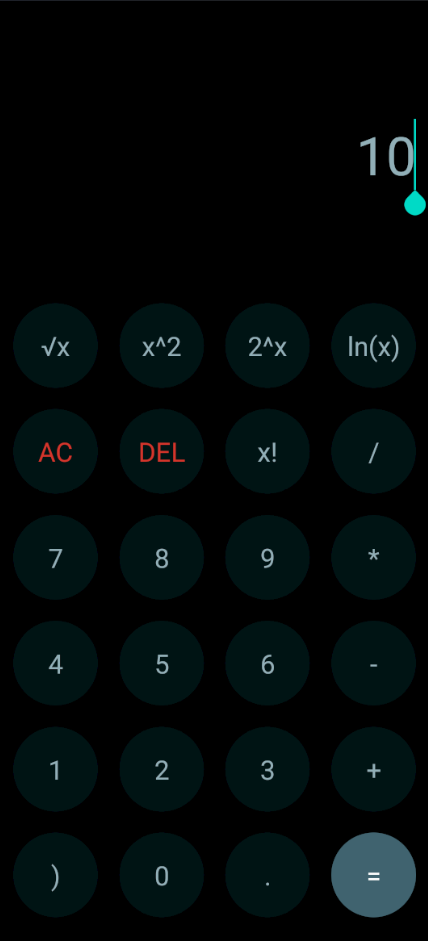

React Native Caculator App

A simple calculator app that enables users to perform basic arithmetic operations like addition, subtraction, multiplication, and division. It also includes advanced features such as exponentiation, square roots, and logarithmic functions for more comprehensive calculations.

## App preview

## About the Author

Hi, I'm the creator and maintainer of this project. I'm passionate about software development and always eager to improve. If you find this project helpful, please consider giving it a star ⭐ – your support means a lot!  

If you encounter any bugs or issues, feel free to report them via email. I appreciate your feedback!  

📧 **Email:** naruto3285@gmail.com